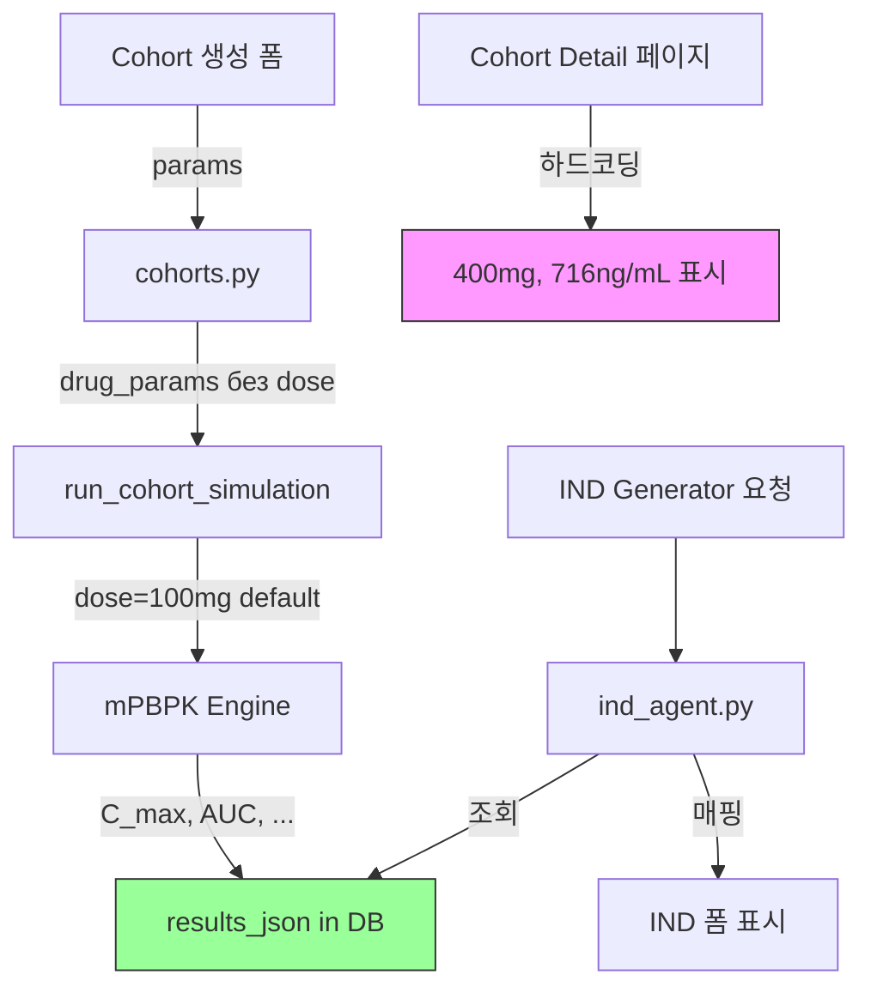

# IND Generator 데이터 매핑 이슈 분석

> **작성일**: 2026-02-06  
> **상태**: 해결 방안 선택 대기  
> **우선순위**: High

---

## 1. 문제 개요

IND Generator 페이지(`/ind/<project_id>`)에서 **Dose, Cmax, AUC 등의 PK 데이터가 올바르게 매핑되지 않는 문제**가 발생했습니다.

### 사용자 기대값 (Cohort Detail 페이지 표시값)
| 필드 | 기대값 |
|------|--------|
| Dose | 400 mg |
| Cmax | 716 ng/mL |
| AUC | ~8,083 ng·hr/mL |
| t½ | 17.6 hr |

### 실제 IND 폼 표시값
| 필드 | 표시값 |
|------|--------|
| Dose | 100 mg |
| Cmax | 551.52 ng/mL |
| AUC | (이론적 계산값) |

---

## 2. 근본 원인 분석

### 2.1 Cohort Detail 페이지의 데이터는 **하드코딩**

`cohort_detail.html` 파일 분석 결과:

```html
<!-- 302-305행: 하드코딩된 텍스트 -->
400mg 코호트 | N=6

<!-- 315행: 하드코딩된 Dose -->
<p class="stat-value">400<span class="text-lg ml-1">mg</span></p>

<!-- 325행: 하드코딩된 Cmax -->
<p class="stat-value">716<span class="text-lg ml-1">ng/mL</span></p>
```

```javascript
// 660-695행: JavaScript 더미 데이터
const phase1Data = {
    pk: [
        { patient: "P01", cmax: 720, tmax: 2, auc: 8450, t12: 17.2, cl: 47.3 },
        { patient: "P02", cmax: 680, tmax: 2, auc: 7820, t12: 18.5, cl: 51.2 },
        // ...
    ]
};
```

> [!IMPORTANT]
> Cohort Detail 페이지에 표시되는 값들은 **DB 조회 결과가 아닌 프로토타입용 더미 데이터**입니다.

### 2.2 실제 시뮬레이션 결과 구조

`mPBPK Engine` (`mpbpk_engine.py`)의 `simulate()` 함수 반환값:

```python
return {
    'time': t, 
    'C_plasma': C_plasma,  # 시계열 농도 데이터
    'C_max': C_max,        # 최대 농도 (nM)
    'AUC': AUC,            # 곡선하면적
    'mean_to': mean_to,    # 평균 Target Occupancy
    # ...
}
```

### 2.3 Dose 정보 누락

코호트 생성 시 (`cohorts.py`):

```python
# 시뮬레이션 호출 - dose_mg 파라미터 누락!
results = inference.run_cohort_simulation(
    cl_ml_min_kg=cl,
    vd_l_kg=vd,
    mw_g_mol=mw,
    fup=fu,
    # dose_mg는 전달되지 않아 기본값 100mg 사용
)

# DB 저장 - dose_mg 없음!
drug_params = {"cl": cl, "vd": vd, "mw": mw, "fu": fu}
```

---

## 3. 이미 완료된 수정사항

`ind_agent.py`에서 **시뮬레이션 결과 키 매핑**을 수정했습니다:

### Before
```python
mean_cmax = results.get("mean_cmax")  # 잘못된 키
mean_auc = results.get("mean_auc")    # 잘못된 키
```

### After
```python
# 실제 시뮬레이션 엔진 출력 키 사용
mean_cmax = results.get("C_max") or results.get("mean_cmax")
mean_auc = results.get("AUC") or results.get("mean_auc")
```

리스트 형태의 결과 처리 로직도 추가:
```python
elif isinstance(results_raw, list):
    valid_items = [r for r in results_raw if isinstance(r, dict)]
    cmax_vals = [r.get("C_max") for r in valid_items if r.get("C_max") is not None]
    # 평균값 계산
```

---

## 4. 해결 방안 (선택 필요)

### Option 1: 실제 시뮬레이션 결과 사용 (현재 상태)

**설명**: `results_json`에 저장된 실제 mPBPK 시뮬레이션 값을 사용

**장점**:
- 실제 시뮬레이션 데이터 기반
- 추가 개발 불필요

**단점**:
- 현재 모든 시뮬레이션이 기본 100mg로 실행됨
- Cohort Detail 페이지 표시값과 불일치

**필요 작업**: 없음 (이미 완료)

---

### Option 2: Dose 입력 기능 추가 (권장)

**설명**: 코호트 생성 시 dose를 입력받고, 해당 dose로 시뮬레이션을 실행

**필요 수정 파일**:

| 파일 | 수정 내용 |
|------|-----------|
| `create_cohort.html` | Dose 입력 필드 추가 |
| `cohorts.py` | dose 파라미터 받아서 시뮬레이션에 전달, `drug_params`에 저장 |
| `inference.py` | `run_cohort_simulation`에 dose 전달 확인 (이미 파라미터 존재) |

**장점**:
- 사용자가 원하는 dose로 시뮬레이션 가능
- DB에 실제 dose 저장
- IND 폼에 정확한 값 매핑

**단점**:
- 기존 코호트 데이터에는 dose 정보 없음 (마이그레이션 필요)

---

### Option 3: Phase별 고정값 하드코딩

**설명**: IND 폼에 Phase별로 미리 정의된 값을 매핑

```python
PHASE_DEFAULTS = {
    "1": {"dose_mg": 400, "cmax": 716, "auc": 8083, "t_half": 17.6},
    "2": {"dose_mg": 300, "cmax": ...},
    "3": {"dose_mg": 300, "cmax": ...}
}
```

**장점**:
- 빠른 구현
- Cohort Detail 페이지와 일관성

**단점**:
- 실제 시뮬레이션 데이터 무시
- 확장성 없음

---

## 5. 관련 파일 참조

| 파일 경로 | 역할 |
|-----------|------|
| [ind_agent.py](file:///d:/KTaivle/ClinicalTrials-main/PKSmart/app/routers/ind_agent.py) | IND 페이지 렌더링 및 데이터 매핑 (수정 완료) |
| [cohorts.py](file:///d:/KTaivle/ClinicalTrials-main/PKSmart/app/routers/cohorts.py) | 코호트 생성 및 시뮬레이션 실행 |
| [cohort_detail.html](file:///d:/KTaivle/ClinicalTrials-main/PKSmart/app/templates/cohort_detail.html) | 코호트 상세 페이지 (하드코딩 더미 데이터) |
| [ind_generator.html](file:///d:/KTaivle/ClinicalTrials-main/PKSmart/app/templates/ind_generator.html) | IND 생성 폼 |
| [mpbpk_engine.py](file:///d:/KTaivle/ClinicalTrials-main/PKSmart/pksmart/mpbpk_engine.py) | mPBPK 시뮬레이션 엔진 |
| [inference.py](file:///d:/KTaivle/ClinicalTrials-main/PKSmart/app/inference.py) | 시뮬레이션 래퍼 함수 |

---

## 6. 스크린샷

### Cohort Detail 페이지 (하드코딩된 더미 데이터)


---

## 7. 다음 단계

1. **Option 선택**: 위 3가지 옵션 중 하나 선택
2. **구현**: 선택한 옵션에 따른 코드 수정
3. **테스트**: IND Generator 페이지에서 값 매핑 확인
4. **Cohort Detail 페이지 수정** (Optional): 더미 데이터 대신 실제 DB 데이터 표시

---

## 8. 참고: 데이터 흐름 다이어그램


