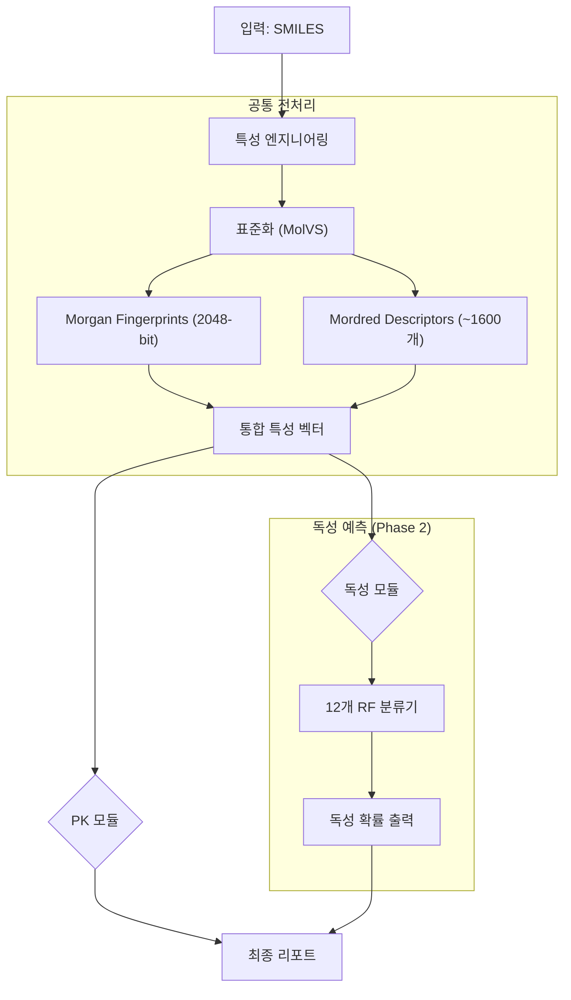

# PKSmart Phase 2: 독성 예측 모듈 (Toxicity Prediction Module)

> **목적**: SMILES 구조로부터 12가지 독성 지표를 예측하여 신약 후보 물질의 안전성을 조기에 평가합니다.

---

## 1. 개요 (Overview)

### 배경
- **Tox21 (Toxicology in the 21st Century)**: NIH에서 주관한 공개 독성 데이터베이스로, 2014년 Tox21 Data Challenge에 사용되었습니다.
- **QSAR 기반 독성 예측**: 분자 구조(SMILES)로부터 화학적 설명자를 추출하고, 머신러닝 모델로 독성 여부를 분류합니다.

### 핵심 특징
| 항목 | 내용 |
|------|------|
| **데이터셋** | Tox21 (약 8,000개 화합물) |
| **예측 타겟** | 12가지 독성 엔드포인트 |
| **모델** | Random Forest Classifier |
| **특성 공학** | Morgan Fingerprint + Mordred Descriptors (PK 모듈과 동일) |

---

## 2. 아키텍처 (Architecture)



### 특성 공유의 장점
- PK 모델과 **완전히 동일한 특성 벡터**를 사용합니다.
- 한 번의 특성 계산으로 PK + 독성 예측이 모두 가능합니다.
- 모델 간 일관성이 유지됩니다.

---

## 3. 예측 타겟 (12가지 독성 엔드포인트)

### Nuclear Receptor (NR) 계열 - 핵수용체 신호전달
| 약어 | 전체 이름 | 설명 |
|------|-----------|------|
| NR-AR | Androgen Receptor | 남성 호르몬 수용체 활성화 |
| NR-AR-LBD | AR Ligand Binding Domain | AR 리간드 결합 도메인 |
| NR-AhR | Aryl Hydrocarbon Receptor | 다이옥신 수용체 (발암성 관련) |
| NR-Aromatase | Aromatase Enzyme | 에스트로겐 합성 효소 억제 |
| NR-ER | Estrogen Receptor | 여성 호르몬 수용체 활성화 |
| NR-ER-LBD | ER Ligand Binding Domain | ER 리간드 결합 도메인 |
| NR-PPAR-gamma | PPARγ | 지방 대사 조절 수용체 |

### Stress Response (SR) 계열 - 스트레스 반응 경로
| 약어 | 전체 이름 | 설명 |
|------|-----------|------|
| SR-ARE | Antioxidant Response Element | 산화 스트레스 반응 |
| SR-ATAD5 | ATAD5 Genotoxicity | DNA 손상 반응 |
| SR-HSE | Heat Shock Element | 열 충격 단백질 반응 |
| SR-MMP | Mitochondrial Membrane Potential | 미토콘드리아 막전위 (세포 사멸 관련) |
| SR-p53 | p53 Pathway | 종양 억제 유전자 경로 |

---

## 4. 성능 평가 결과 (Performance)

### 평가 방법
- **Train/Test Split**: 80% / 20% (Stratified)
- **평가 지표**: AUC-ROC (불균형 데이터에 적합)

### 결과 테이블
| Task | N_Train | N_Test | AUC-ROC | Accuracy |
|------|---------|--------|---------|----------|
| NR-AR | 5,806 | 1,452 | 0.758 | 96.9% |
| NR-AR-LBD | 5,400 | 1,351 | **0.892** | 97.9% |
| NR-AhR | 5,233 | 1,309 | **0.878** | 90.0% |
| NR-Aromatase | 4,652 | 1,163 | **0.882** | 95.7% |
| NR-ER | 4,948 | 1,238 | 0.696 | 88.5% |
| NR-ER-LBD | 5,558 | 1,390 | **0.846** | 96.6% |
| NR-PPAR-gamma | 5,154 | 1,289 | 0.747 | 97.2% |
| SR-ARE | 4,660 | 1,165 | **0.831** | 86.2% |
| SR-ATAD5 | 5,652 | 1,413 | **0.862** | 96.2% |
| SR-HSE | 5,168 | 1,292 | 0.768 | 94.4% |
| SR-MMP | 4,643 | 1,161 | **0.907** | 89.1% |
| SR-p53 | 5,413 | 1,354 | **0.833** | 93.9% |

### 요약
- **평균 AUC-ROC**: 0.8251 ✅
- **해석**: GOOD (0.8 이상이면 신뢰할 수 있는 수준)
- **최고 성능**: SR-MMP (0.907), NR-AR-LBD (0.892)
- **개선 필요**: NR-ER (0.696) - 복잡한 구조-활성 관계

---

## 5. 파일 구조 (File Structure)

```
PKSmart/
├── pksmart_train_tox.py    # 독성 모델 학습 스크립트
├── pksmart_eval_tox.py     # 성능 평가 스크립트
├── data/
│   └── tox21.csv           # Tox21 원본 데이터
├── models/
│   └── tox/                # 학습된 독성 모델들
│       ├── NR-AR_model.joblib
│       ├── NR-AR-LBD_model.joblib
│       ├── NR-AhR_model.joblib
│       ├── ... (12개 모델)
│       └── imputer.joblib  # 결측치 처리용
└── pksmart/
    └── features.py         # 특성 추출 (PK와 공유)
```

---

## 6. 사용 방법 (Usage)

### 모델 학습
```bash
docker run --rm -v ${PWD}:/app pksmart python pksmart_train_tox.py
```

### 성능 평가
```bash
docker run --rm -v ${PWD}:/app pksmart python pksmart_eval_tox.py
```

### 예측 (통합 파이프라인 - 추후 구현)
```bash
docker run --rm -v ${PWD}:/app pksmart python pksmart_predict.py --smiles "CCO" --tox
```

---

## 7. 과학적 근거 (Scientific Rationale)

### NAMs (New Approach Methodologies) 관점
1. **동물 실험 대체**: 
   - 전통적 독성 시험은 동물에게 약물을 투여하고 관찰해야 합니다.
   - QSAR 기반 예측은 컴퓨터 시뮬레이션으로 사전 스크리닝이 가능합니다.

2. **3R 원칙 기여**:
   - **Replacement**: 동물 실험을 대체
   - **Reduction**: 필요한 동물 수 감소
   - **Refinement**: 더 정밀한 타겟팅

3. **규제 동향**:
   - FDA/EMA는 In-silico 독성 예측을 보조 데이터로 인정하고 있습니다.
   - ICH M7 가이드라인: 변이원성 예측에 QSAR 사용 권장

### 한계점
- **Applicability Domain**: 학습 데이터와 유사한 화합물에서만 신뢰할 수 있습니다.
- **메커니즘 설명 불가**: 왜 독성이 있는지 설명하지 못합니다 (블랙박스).
- **In-vivo 대체 불가**: 최종 안전성 평가는 여전히 동물/임상 시험이 필요합니다.

---

## 8. 향후 계획 (Future Work)

- [ ] `pksmart_predict.py`에 독성 예측 통합
- [ ] ProTox-III 스타일의 LD50 예측 추가
- [ ] Graph Neural Network 기반 모델 실험
- [ ] Applicability Domain 분석 추가

---

*마지막 업데이트: 2026-01-27*
